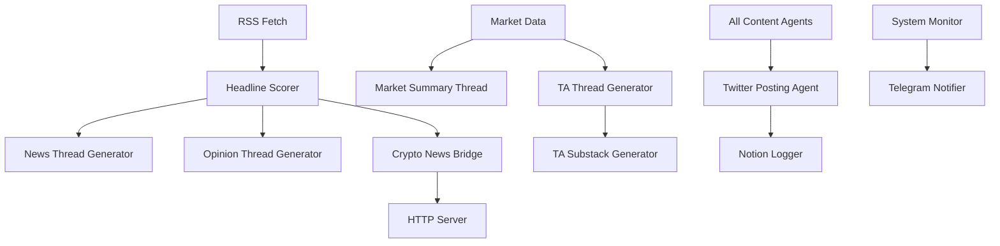

# AGENTS.md - System Architecture Documentation for AI Agents

## System Overview

The XAI Agent is a comprehensive cryptocurrency content generation and social media automation system built around the "Hunter" persona - an AI-powered crypto analyst dog. The system operates as a distributed agent architecture with multiple specialized components.

### Core Identity: Hunter the Web3 Dobie 🐾
- **Primary Role**: Crypto market analyst and content creator
- **Voice**: Witty, insightful, Web3-native, ends communications with "— Hunter 🐾"
- **Output Channels**: Twitter/X threads, Substack articles, website content
- **Content Types**: Market analysis, news commentary, technical analysis, educational explainers

## System Architecture

### Agent Classification

#### 1. Data Ingestion Agents
**RSS Feed Aggregator**
- **File**: `utils/rss_fetch.py`
- **Function**: Fetches crypto news from 15+ RSS sources hourly
- **Data Flow**: RSS → CSV (`scored_headlines.csv`) → GPT Scoring → Notion
- **Sources**: Coindesk, Decrypt, CryptoSlate, Cointelegraph, BeInCrypto, etc.
- **Rate Limiting**: 150 headlines max per ingestion cycle

**Headline Scoring Agent**
- **File**: `utils/scorer.py`
- **Function**: GPT-4 powered relevance and viral potential scoring (1-10 scale)
- **Input**: Raw headlines + extracted tickers
- **Output**: Scored headlines (threshold: 7+ for use)
- **Prompt Template**: "Score this news headline about {ticker} from 1 to 10, based on how likely it is to go viral on Twitter"

**Market Data Agent**
- **File**: `content/market_summary.py`
- **Function**: Fetches OHLCV data from Binance API
- **Tokens**: BTC, ETH, SOL, XRP, DOGE
- **Technical Indicators**: SMA (10, 50, 200), RSI, MACD
- **Chart Generation**: Matplotlib with TA overlays

#### 2. Content Generation Agents
**Thread Generator Agent**
- **File**: `utils/gpt.py`
- **Models**: Azure OpenAI GPT-4
- **Thread Types**: 
  - News recap (3 parts)
  - Market summary (5 parts)
  - Opinion threads (3 parts)
  - TA analysis (4 parts)
- **Delimiter**: "---" for multi-part content

**Substack Article Agent**
- **Files**: `content/ta_substack_generator.py`, `content/explainer_writer.py`
- **Base Class**: `utils/base_article_generator.py`
- **Output Format**: Markdown with embedded charts
- **Publishing Pipeline**: Local save → Azure Blob → Notion logging → Tweet announcement

**Technical Analysis Agent**
- **File**: `content/ta_thread_generator.py`
- **Data Source**: Binance OHLCV (1000 days historical)
- **Indicators**: SMA10/50/200, RSI(14), MACD(12,26,9)
- **Chart Output**: Multi-panel candlestick + indicators
- **Memory System**: References previous week's analysis

#### 3. Social Media Agents
**Twitter/X Posting Agent**
- **File**: `utils/x_post.py`
- **API**: Twitter API v2 with v1.1 media upload
- **Rate Limits**: Built-in backoff and retry logic
- **Thread Safety**: Mutex locks for concurrent posting
- **Media Support**: PNG image uploads with tweets

**Reply Handler Agent**
- **File**: `content/reply_handler.py`
- **Function**: Monitors mentions, replies to direct responses
- **Rate Limit**: 1 reply per run, 5-minute cooldown
- **Context Matching**: Cross-references own tweet IDs from CSV log

**Random Content Agent**
- **File**: `content/random_post.py`
- **Probability Distribution**: 98% original, 1% quote tweet, 1% reply
- **XRP Special Logic**: Daily XRP headline usage with flag file
- **Content Enhancement**: Auto-insertion of cashtags and mentions

#### 4. Website Integration Agents
**News Bridge Agent**
- **File**: `crypto_news_bridge.py`
- **Function**: Processes headlines for DutchBrat.com integration
- **Output**: JSON API format with Hunter commentary
- **Rotation**: Top 4 headlines, 15-minute intervals
- **Source Mapping**: URL domain extraction to clean source names

**HTTP Server Agent**
- **File**: `http_server.py`
- **Process Manager**: `process_http_manager.py`
- **Endpoints**: `/crypto-news-data`, `/health`
- **Port**: 3001
- **Monitoring**: Health checks, auto-restart, resource tracking

#### 5. Monitoring and Maintenance Agents
**System Health Agent**
- **File**: `scheduler.py` (heartbeat function)
- **Frequency**: Every 15 minutes
- **Metrics**: CPU, memory, job stats, HTTP server status
- **Notification**: Telegram alerts with markdown formatting

**Log Rotation Agent**
- **File**: `utils/rotate_logs.py`
- **Schedule**: Weekly (Sundays)
- **Strategy**: Rolling retention for headlines (7 days), archive for logs
- **Cleanup**: XRP flag reset, memory optimization

**Job Registry Agent**
- **File**: `jobs/registry.py`
- **Function**: Centralized job management with categories and dependencies
- **Monitoring**: Execution stats, failure tracking, circuit breakers
- **Categories**: DATA_INGESTION, CONTENT_GENERATION, SOCIAL_POSTING, WEBSITE_GENERATION, MAINTENANCE, MONITORING

## Data Models and Schemas

### Primary Data Storage
```
data/scored_headlines.csv:
- score: float (1-10)
- headline: string
- url: string  
- ticker: string (extracted)
- timestamp: ISO datetime

data/tweet_log.csv:
- tweet_id: string
- timestamp: datetime
- type: string
- category: string
- text: string (optional)
- engagement_score: float

data/ta_log.csv:
- date: date
- token: string
- close: float
- sma10/50/200: float
- rsi: float
- macd/macd_signal: float
- gpt_summary: text
```

### Configuration Schema
```yaml
# Azure OpenAI
AZURE_OPENAI_API_KEY: string
AZURE_DEPLOYMENT_ID: string
AZURE_API_VERSION: string (default: "2024-02-15-preview")
AZURE_RESOURCE_NAME: string

# Twitter/X API
X_API_KEY: string
X_API_SECRET: string  
X_ACCESS_TOKEN: string
X_ACCESS_TOKEN_SECRET: string
X_BEARER_TOKEN: string
X_BOT_USER_ID: string

# Notion Integration
NOTION_API_KEY: string
HEADLINE_VAULT_DB_ID: string
NOTION_TWEET_LOG_DB: string
NOTION_SUBSTACK_ARCHIVE_DB_ID: string

# Telegram Notifications
TG_BOT_TOKEN: string
TG_CHAT_ID: string

# Azure Blob Storage
AZURE_BLOB_CONNECTION_STRING: string
AZURE_BLOB_CONTAINER_NAME: string (default: "substack-articles")

# Email/SMTP
SMTP_HOST: string
SMTP_PORT: int (default: 587)
SMTP_USER: string
SMTP_PASS: string
ALERT_RECIPIENT: string
```

### Directory Structure
```
XAIAgent/
├── content/           # High-level orchestration agents
├── utils/            # Core utility agents and helpers
├── jobs/             # Job registry and scheduling system
├── data/             # Runtime data storage (CSV files)
├── logs/             # Application logs
├── charts/           # Generated technical analysis charts
├── backup/           # Rotated log archives
├── ta_posts/         # Technical analysis markdown archives
└── world3_agent/     # Specialized token monitoring agents
```

## Agent Communication Patterns

### Inter-Agent Dependencies


### Data Flow Patterns
1. **News Pipeline**: RSS → Scoring → Storage → Content Generation → Publishing
2. **Market Pipeline**: API → Analysis → Charting → Content → Publishing  
3. **Monitoring Pipeline**: Metrics Collection → Health Assessment → Alerting
4. **Website Pipeline**: Data Processing → JSON Export → HTTP Serving

## Operational Procedures

### Startup Sequence
1. Environment validation (API keys, directories)
2. Port cleanup (kill orphaned processes on 3001)
3. Job registry initialization and scheduling
4. HTTP server process launch with health verification
5. Monitoring thread activation
6. Telegram startup notification

### Error Handling Strategies
- **Rate Limiting**: Exponential backoff with circuit breakers
- **API Failures**: Retry with progressive delays (5min, 10min, 15min)
- **Content Generation**: Fallback to cached/template responses
- **Server Crashes**: Process manager with auto-restart policies
- **Data Corruption**: Validation and cleanup procedures

### Recovery Procedures
- **Telegram Alerts**: All ERROR level events trigger notifications
- **Process Monitoring**: PID tracking, memory usage, response times
- **Health Checks**: HTTP endpoint monitoring every 30 seconds
- **Circuit Breakers**: Automatic job disabling after 3 consecutive failures

## AI Behavioral Context

### Hunter Persona Guidelines
- **Tone**: Confident but not hype-driven, analytical, witty
- **Signature**: Always end with "— Hunter 🐾"
- **Emoji Usage**: Strategic, not excessive
- **Hashtags**: 1-2 relevant tags maximum
- **Cashtags**: Auto-insertion for major tokens ($BTC, $ETH, etc.)

### Content Generation Rules
- **Thread Length**: 3-5 parts maximum
- **Tweet Length**: <280 characters per part
- **Delimiter**: "---" for GPT thread separation
- **No Numbering**: Tweets should not be numbered (1/3, 2/3, etc.)
- **Link Placement**: URLs only in final tweet of threads

### Market Analysis Context
- **Timeframes**: Daily for news, weekly for TA, monthly for long-form
- **Data Sources**: Binance for price data, multiple RSS for news
- **Objectivity**: Avoid price predictions, focus on technical observations
- **Educational**: Explain concepts for crypto newcomers

## Security and Safety Mechanisms

### Rate Limiting
- **Daily Tweet Limit**: 17 tweets maximum (configurable via MAX_DAILY_TWEETS)
- **API Cooldowns**: 5-second delays between Twitter API calls
- **Retry Limits**: Maximum 3 attempts per failed operation

### Content Safety
- **Prompt Sanitization**: Clean escaped characters and markdown
- **Response Validation**: Check for appropriate signature and formatting
- **Source Verification**: URL validation before including in content
- **Duplicate Prevention**: CSV-based tracking of used content

### System Safety
- **Process Isolation**: HTTP server runs in separate process
- **Resource Monitoring**: Memory and CPU usage tracking
- **Graceful Shutdown**: SIGTERM/SIGINT handlers for clean termination
- **Backup Systems**: Automated log rotation and data archiving

## Integration Endpoints

### External APIs
- **Twitter API v2**: Tweet posting, thread creation, media upload
- **Twitter API v1.1**: Media upload (images)
- **Binance Public API**: OHLCV market data
- **OpenAI/Azure**: GPT-4 content generation
- **Notion API**: Database logging and content management
- **Telegram Bot API**: System notifications and alerts

### Internal Interfaces
- **Job Registry**: Centralized scheduling and dependency management  
- **File System**: CSV data persistence and log management
- **Process Communication**: HTTP health endpoints and status reporting
- **Configuration Management**: Environment variable and secrets handling

## Deployment Considerations

### Production Requirements
- **Python 3.8+**: Core runtime environment
- **Process Manager**: Supervisor or systemd for service management  
- **Network Access**: Outbound HTTPS for all API integrations
- **Storage**: Persistent disk for logs, data, and generated content
- **Monitoring**: External health check integration recommended

### Scaling Factors
- **Concurrent Jobs**: Thread-safe design supports parallel execution
- **API Rate Limits**: Built-in backoff prevents service degradation
- **Memory Management**: Log rotation and cache cleanup procedures
- **Process Isolation**: HTTP server separation enables independent scaling

This documentation provides comprehensive system context for AI agents working on this project. All components are designed for autonomous operation with human oversight through monitoring and alerting systems.