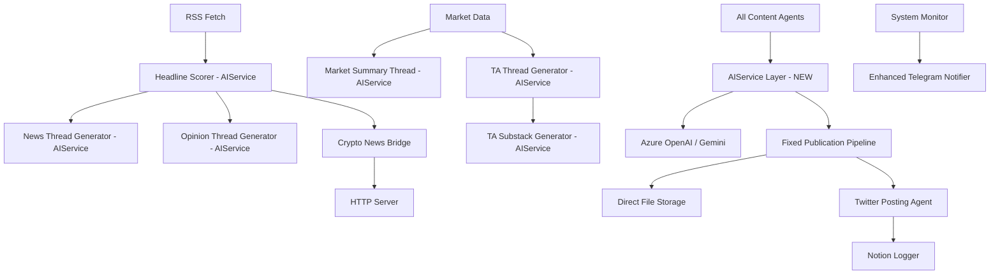

# AGENTS.md - System Architecture Documentation for AI Agents

## System Overview

The Hunter-Agent (formerly XAI Agent) is a comprehensive cryptocurrency content generation and social media automation system built around the "Hunter" persona - an AI-powered crypto analyst dog. The system operates as a containerized microservice within a larger ecosystem on DutchBrat.com, running on local VM infrastructure with Docker orchestration.

### Infrastructure Architecture

The Hunter-Agent runs as a containerized microservice within a broader ecosystem:

```
DutchBrat.com Ecosystem:
├── postgres (Database)
├── redis (Cache)
├── frontend (Next.js)
├── market-data-service (Port 8001)
├── htd-agent (HTD Research Agent - Port 3002)
├── hunter-agent (Crypto Content Agent - Port 3001)
└── nginx-articles (Static file server for articles)
```

**Container Network**: `production-network` (Docker Bridge)
**Orchestration**: Docker Compose
**Storage**: Local VM volumes with Docker bind mounts
**Article Serving**: Direct file storage with DutchBrat.com integration

### Core Identity: Hunter the Web3 Dobie 🐾
- **Primary Role**: Crypto market analyst and content creator
- **Voice**: Witty, insightful, Web3-native, ends communications with "— Hunter 🐾"
- **Output Channels**: Twitter/X threads, website articles, social media
- **Content Types**: Market analysis, news commentary, technical analysis, educational explainers

## AI Provider Architecture (Updated October 2025)

### **Hybrid AIService Implementation**
The Hunter-Agent now uses a sophisticated AI provider abstraction layer that supports multiple AI providers with seamless switching and backward compatibility:

```
Content Generators (No Changes Needed)
           ↓
    Backward Compatible Wrappers
           ↓
     AIService Layer (New)
     ┌─ Provider Selection
     ├─ Rate Limiting  
     ├─ Error Handling
     └─ Usage Monitoring
           ↓
Azure OpenAI ←→ Google Gemini ←→ Future Providers
```

### **Provider Configuration**
- **Current Setup**: Environment-based provider switching
- **Configuration Files**: 
  - `~/production-stack/config/secrets/api-keys.env` (API keys)
  - `~/production-stack/config/services/hunter-agent.env` (provider selection)
- **API Keys**: 
  - `GEMINI_HUNTER-AGENT_API_KEY` (Agent-specific Gemini key)
  - `AZURE_OPENAI_API_KEY` (Existing Azure key for fallback)
- **Provider Selection**: `AI_PROVIDER=azure|gemini`

### **Rate Limiting & Queueing**
- **Gemini Limits**: 60 requests/minute (configured to 50 req/min with buffer)
- **Smart Queueing**: Automatic request queuing during high-volume periods
- **Headline Scoring**: Primary use case for rate limiting (highest volume operation)
- **Transparent Operation**: All requests served, distributed over time to respect limits

### **Zero-Downtime Migration Capability**
- **Instant Rollback**: Change `AI_PROVIDER=azure` and restart
- **Backward Compatibility**: All existing `generate_gpt_*` functions work unchanged
- **Modern Interface**: New `AIService` class available for enhanced features
- **Monitoring**: Usage tracking and provider performance logging

## System Architecture

### Agent Classification

#### 1. Data Ingestion Agents
**RSS Feed Aggregator**
- **File**: `utils/rss_fetch.py`
- **Function**: Fetches crypto news from 15+ RSS sources hourly
- **Data Flow**: RSS → CSV (`scored_headlines.csv`) → AI Scoring → Notion
- **Sources**: Coindesk, Decrypt, CryptoSlate, Cointelegraph, BeInCrypto, etc.
- **Rate Limiting**: 150 headlines max per ingestion cycle
- **Logging**: ✅ **FIXED** - Standardized logging implementation

**Headline Scoring Agent**
- **File**: `utils/scorer.py`
- **Function**: **UPDATED** - AI-powered relevance and viral potential scoring (1-10 scale)
- **AI Provider**: Uses new AIService layer (Azure OpenAI or Gemini)
- **Input**: Raw headlines + extracted tickers
- **Output**: Scored headlines (threshold: 7+ for use)
- **Rate Limiting**: **NEW** - Automatic queueing during high-volume scoring periods
- **Prompt Template**: "Score this news headline about {ticker} from 1 to 10, based on how likely it is to go viral on Twitter"

**Market Data Agent**
- **File**: `content/market_summary.py`
- **Function**: Fetches OHLCV data from Binance API
- **Tokens**: BTC, ETH, SOL, XRP, DOGE
- **Technical Indicators**: SMA (10, 50, 200), RSI, MACD
- **Chart Generation**: Matplotlib with TA overlays

#### 2. Content Generation Agents (AI Provider Enhanced)
**Thread Generator Agent**
- **File**: `utils/gpt.py` **UPDATED** - Now uses AIService layer
- **AI Providers**: Azure OpenAI GPT-4 or Google Gemini (configurable)
- **Backward Compatibility**: ✅ All existing functions work unchanged
- **Thread Types**: 
  - News recap (3 parts)
  - Market summary (5 parts)
  - Opinion threads (3 parts)
  - TA analysis (4 parts)
- **Delimiter**: "---" for multi-part content
- **Rate Limiting**: **NEW** - Automatic for Gemini provider

**Article Publication Agent**
- **File**: `utils/publish_substack_article.py`
- **Function**: **FIXED** direct file creation pipeline (no temporary files)
- **Output Format**: Markdown with embedded images
- **Publishing Pipeline**: Direct file write → Email notification → Notion logging → Tweet announcement
- **Article Storage**: `/app/posts` directory (Docker volume: `./hunter-agent-posts`)
- **Filename Convention**: `YYYY-MM-DD_slugified-headline.md`
- **Article Serving**: Integrated with DutchBrat.com at `/articles?articleId={notion_page_id}`
- **Status**: ✅ **Manual Testing Confirmed** | ⏳ **Scheduled Job Testing Pending**

**Explainer Article Agent**
- **File**: `content/explainer_writer.py`
- **Function**: **REWRITTEN** to bypass BaseArticleGenerator temp file issues
- **AI Provider**: **UPDATED** - Uses new AIService layer via `generate_gpt_text()`
- **Base**: Uses fixed `publish_substack_article.py` directly
- **Trigger**: Fridays at 23:45 UTC
- **Content**: Educational crypto explanations based on top weekly headlines
- **Provider Benefits**: **NEW** - Can leverage Gemini's larger context window for richer articles
- **Status**: ✅ **Manual Testing Confirmed** | ⏳ **Friday Schedule Test Pending**

**Technical Analysis Agent**
- **File**: `content/ta_substack_generator.py`
- **Base Class**: `utils/base_article_generator.py` (uses fixed publication pipeline)
- **AI Provider**: **UPDATED** - Uses AIService layer for content generation
- **Data Source**: Binance OHLCV (1000 days historical)
- **Indicators**: SMA10/50/200, RSI(14), MACD(12,26,9)
- **Chart Output**: Multi-panel candlestick + indicators
- **Memory System**: References previous week's analysis
- **Trigger**: Sundays at 18:00 UTC
- **Provider Benefits**: **NEW** - Gemini's larger context could include more historical data
- **Status**: ✅ **Manual Testing Confirmed** | ⏳ **Sunday Schedule Test Pending**

**TA Thread Generator Agent**
- **File**: `content/ta_thread_generator.py`
- **Function**: Daily technical analysis threads for individual tokens
- **AI Provider**: **UPDATED** - Uses AIService layer via `generate_gpt_thread()`
- **Schedule**: Weekdays (BTC Mon, ETH Tue, SOL Wed, XRP Thu, DOGE Fri)
- **Chart Generation**: Real-time price charts with technical indicators
- **Rate Limiting**: **NEW** - Automatic queueing if using Gemini during high-volume periods

#### 3. Social Media Agents
**Twitter/X Posting Agent**
- **File**: `utils/x_post.py`
- **API**: Twitter API v2 with v1.1 media upload
- **Rate Limits**: Built-in backoff and retry logic
- **Thread Safety**: Mutex locks for concurrent posting
- **Media Support**: PNG image uploads with tweets
- **Enhanced Logging**: **UPDATED** to capture tweet text in logs

**Reply Handler Agent**
- **File**: `content/reply_handler.py`
- **Function**: Monitors mentions, replies to direct responses
- **AI Provider**: **UPDATED** - Uses AIService layer for response generation
- **Rate Limit**: 1 reply per run, 5-minute cooldown
- **Context Matching**: Cross-references own tweet IDs from CSV log

**Random Content Agent**
- **File**: `content/random_post.py`
- **AI Provider**: **UPDATED** - Uses AIService layer via `generate_gpt_tweet()`
- **Probability Distribution**: 98% original, 1% quote tweet, 1% reply
- **XRP Special Logic**: Daily XRP headline usage with flag file
- **Content Enhancement**: Auto-insertion of cashtags and mentions

#### 4. Website Integration Agents
**News Bridge Agent**
- **File**: `crypto_news_bridge.py`
- **Function**: Processes headlines for DutchBrat.com integration
- **Output**: JSON API format with Hunter commentary
- **Rotation**: Top 4 headlines, 15-minute intervals
- **Source Mapping**: URL domain extraction to clean source names
- **Logging**: ✅ **FIXED** - Replaced print() with proper logging

**HTTP Server Agent**
- **File**: `http_server.py`
- **Process Manager**: `process_http_manager.py`
- **Endpoints**: `/crypto-news-data`, `/health`
- **Port**: 3001 (containerized)
- **Monitoring**: Health checks, auto-restart, resource tracking
- **Container**: Runs within Docker ecosystem alongside other microservices

#### 5. Content Workflow Orchestration Agents
**Content Decision Agent**
- **File**: `content/top_news_or_explainer.py`
- **Function**: **FIXED** - removed substack URL dependencies
- **AI Provider**: **UPDATED** - Uses AIService layer for content generation
- **Logic**: Friday = explainer article, other days = opinion threads
- **Integration**: Seamless handoff between content types

**Explainer Thread Agent**
- **File**: `content/explainer.py`
- **Function**: **UPDATED** - generates announcement threads for published articles
- **AI Provider**: **UPDATED** - Uses AIService layer via `generate_gpt_thread()`
- **Integration**: Works with explainer_writer.py to create social media promotion
- **Content**: 3-part Twitter threads with article links

#### 6. Monitoring and Maintenance Agents
**System Health Agent**
- **File**: `scheduler.py` (heartbeat function)
- **Frequency**: Every 15 minutes
- **Metrics**: CPU, memory, job stats, HTTP server status, **NEW** - AI provider usage
- **Notification**: Telegram alerts with markdown formatting
- **AI Provider Monitoring**: **NEW** - Tracks provider performance and rate limiting
- **Status**: ✅ **FIXED** - Enhanced error handling and logging

**Log Rotation Agent**
- **File**: `utils/rotate_logs.py`
- **Schedule**: Weekly (Sundays at 23:50 UTC)
- **Strategy**: Rolling retention for headlines (7 days), archive for logs
- **Cleanup**: XRP flag reset, memory optimization
- **Status**: ✅ **FIXED** - Replaced print() with logging, enhanced error handling | ⏳ **Sunday Test Pending**

**Job Registry Agent**
- **File**: `jobs/registry.py`
- **Function**: Centralized job management with categories and dependencies
- **Monitoring**: Execution stats, failure tracking, circuit breakers
- **Error Handling**: **IMPROVED** - jobs now fail properly when publication fails
- **AI Provider Tracking**: **NEW** - Monitors AI service performance per job
- **Categories**: DATA_INGESTION, CONTENT_GENERATION, SOCIAL_POSTING, WEBSITE_GENERATION, MAINTENANCE, MONITORING

## Recent System Improvements (October 2025)

### 🤖 **AI Provider Migration (October 2025)**

#### **Hybrid AIService Architecture Implementation**
- **Problem**: Single dependency on Azure OpenAI with cost and rate limiting concerns
- **Solution**: Implemented provider-agnostic AIService layer with Gemini integration
- **Benefits**: 
  - Cost reduction through Gemini's free tier
  - Better performance with Gemini 1.5 Pro
  - Future-proof architecture for additional providers
  - Zero downtime provider switching capability

#### **Backward Compatibility Achievement**
- **Challenge**: Existing codebase with 6+ modules using `generate_gpt_*` functions
- **Solution**: Maintained all existing function signatures with wrapper layer
- **Impact**: ✅ **Zero code changes required in content generation modules**
- **Testing**: ✅ **All existing functionality preserved**

#### **Smart Rate Limiting & Queueing System**
- **Challenge**: Gemini's 60 requests/minute limit vs. high-volume headline scoring
- **Solution**: Implemented token bucket algorithm with automatic request queueing
- **Features**:
  - 50 req/min conservative limit (10 request buffer)
  - Automatic request queuing during high-volume periods
  - All requests served, just distributed over time
  - Transparent operation - no failed requests due to rate limits

#### **Multi-Agent API Key Architecture**
- **Innovation**: Agent-specific API key naming convention
- **Implementation**: `GEMINI_HUNTER-AGENT_API_KEY` for Hunter Agent
- **Scalability**: Ready for multiple agents with isolated rate limits:
  - Hunter Agent: 60 req/min
  - Future Research Agent: 60 req/min  
  - Future News Agent: 60 req/min
  - **Total System Capacity**: 180+ req/min across all agents

#### **Production-Stack Configuration Integration**
- **Challenge**: Shared configuration files across production ecosystem
- **Solution**: Seamless integration with existing config structure
- **Files Updated**:
  - `~/production-stack/config/secrets/api-keys.env` (API keys)
  - `~/production-stack/config/services/hunter-agent.env` (provider selection)
- **Benefits**: Consistent configuration management across all services

### 🔧 **Comprehensive Logging System Implementation (October 10, 2025)**

#### **Problem Statement**
- Log fragmentation across multiple files (gpt.log, x_post.log, etc.)
- No centralized job execution tracking
- Difficult to trace job execution across modules
- I/O errors from stdout/stderr wrapping attempts

#### **Solution: Three-Phase Logging Architecture**

**Phase 1: Centralized Application Logging**
- **Implementation**: Enhanced `scheduler.py` with unified logging configuration
- **Format**: `%(asctime)s | %(levelname)-8s | %(name)-30s | %(funcName)-25s | %(message)s`
- **Handlers**: 
  - StreamHandler (stdout) → Docker captures
  - RotatingFileHandler (`/app/logs/hunter-agent.log`, 50MB, 5 backups)
- **Benefits**: All modules automatically log to same stream with module/function context

**Phase 2: Database Job Execution Tracking**
- **New Table**: `job_executions` with comprehensive execution metadata
- **Columns**: 
  - Job identification (name, category)
  - Timing (started_at, completed_at, duration_seconds)
  - Status tracking (running, success, failed)
  - Error capture (error_message, error_traceback)
  - Flexible metadata (JSONB field)
- **New DatabaseService Methods** (5 total):
  - `start_job_execution()` - Record job start
  - `complete_job_execution()` - Record completion with status
  - `get_recent_job_executions()` - Query execution history
  - `get_failed_jobs()` - Find failures in time window
  - `get_job_statistics()` - Aggregate performance metrics
  **Comment Storage Methods (NEW - October 12, 2025):**
  - `batch_insert_headlines_with_comments()` - Insert headlines with pre-generated AI comments
  - `get_recent_headlines_for_display()` - UPDATED to include hunter_comment field

**Phase 3: Automatic Job Registry Integration**
- **Modified**: `jobs/registry.py` → `_create_wrapped_job()` method
- **Features**:
  - Automatic tracking for every job execution
  - Graceful degradation if database fails
  - Full traceback capture on failures
  - Backward compatible with in-memory stats
- **Status**: ✅ **VERIFIED WORKING** (fetch_headlines tracked successfully)

#### **Monitoring Commands**

**Check Recent Job Executions:**
docker-compose exec hunter-agent python -c 'from services.database_service import DatabaseService; db = DatabaseService(); execs = db.get_recent_job_executions(limit=10); [print(f"{e[1]}: {e[5]}") for e in execs]'

docker-compose exec hunter-agent python -c 'from services.database_service import DatabaseService; db = DatabaseService(); failed = db.get_failed_jobs(hours=24); print(f"Failed: {len(failed)}"); [print(f"{f[1]}: {f[3]}") for f in failed]'

docker-compose exec hunter-agent python -c 'from services.database_service import DatabaseService; db = DatabaseService(); stats = db.get_job_statistics("fetch_headlines", days=7); print(stats) if stats else print("No data")'

docker-compose exec hunter-agent python -c 'from services.database_service import DatabaseService; db = DatabaseService(); execs = db.get_recent_job_executions(limit=1); print("Tracking operational") if execs else print("No executions recorded")'

docker-compose exec hunter-agent python -c 'from services.database_service import DatabaseService; db = DatabaseService(); execs = db.get_recent_job_executions(limit=1); exec = execs[0]; print(f"Job: {exec[1]}, Status: {exec[5]}, Duration: {exec[6]:.2f}s")'

Benefits Achieved
✅ Unified Log Stream - No more fragmented log files
✅ Job History - Query any job's execution history
✅ Performance Tracking - Success rates, average durations, trends
✅ Failure Debugging - Full tracebacks stored in database
✅ Graceful Degradation - Jobs execute even if tracking fails
✅ Docker-Native - Logs captured by Docker for ecosystem monitoring

### 🔧 **Rate Limiter & Gemini Comment Caching (October 12, 2025)**

#### **Problem Statement**
- X (Twitter) rate limiter incorrectly blocking posts on fresh container starts
- Gemini API rate limit exhaustion (10 RPM) from HTTP endpoint generating comments on every request
- Infinite loop in another agent caused 429 errors and service disruption

#### **Solution: Two-Phase Fix**

**Phase A: Fixed Rate Limiter Logic**
- **File**: `utils/rate_limit_manager.py`
- **Issue**: Fresh start state (`last_updated=None, reset_timestamp=0`) not handled correctly
- **Fix**: Added fresh start check to return `False` (not limited) when state is uninitialized
- **Enhanced Logging**: Rate limit warnings now include actual state values for debugging
- **Result**: ✅ Posts now work correctly after container restarts

**Phase B: Comment Caching & Database Storage**
- **Issue**: HTTP endpoint `/crypto-news-data` called Gemini for every request, causing rate limit bursts
- **Solution 1 - In-Memory Cache**:
  - Class-level cache in `hunter_http_server.py`
  - 5-minute TTL per headline comment
  - Prevents regenerating same comment on rapid requests
  
- **Solution 2 - Database Persistence**:
  - Added `hunter_comment TEXT` column to `headlines` table
  - Comments generated once during headline ingestion (not on every HTTP request)
  - New method: `batch_insert_headlines_with_comments()`
  - Updated `get_recent_headlines_for_display()` to include comments
  - HTTP endpoint now serves pre-generated comments from database

**Files Modified:**
- `utils/rate_limit_manager.py` - Fixed fresh start logic, enhanced logging
- `hunter_http_server.py` - Added two-tier caching (memory + database)
- `services/database_service.py` - New methods for comment storage
- `jobs/data_ingestion.py` - Generates comments during headline scoring

**Impact:**
- ✅ Rate limiter works correctly on fresh starts
- ✅ Gemini API protected from burst requests (10 RPM limit respected)
- ✅ HTTP endpoint can handle unlimited requests without hitting API limits
- ✅ Comments generated once and reused efficiently
- ✅ Verified working: 7 headlines with pre-generated comments serving via HTTP endpoint

### 🔧 **Critical Fixes Implemented**

#### **System Stability Overhaul (September 23, 2025)**
- **Problem**: "I/O operation on closed file" errors during startup and scheduled operations
- **Root Cause**: stdout/stderr wrapping in scheduler.py interfering with normal I/O operations
- **Solution**: Removed problematic I/O redirection and implemented proper logging throughout
- **Impact**: ✅ **Clean startup achieved** | ⏳ **Scheduled job stability pending verification**

#### **Logging Infrastructure Standardization**
- **Before**: Mixed print() statements and inconsistent logging across modules
- **After**: Standardized logging.getLogger() usage throughout entire system
- **Benefits**: Better debugging, consistent log formatting, proper log levels
- **Files Updated**: 
  - `scheduler.py` - ✅ **Complete logging overhaul**
  - `jobs/definitions.py` - ✅ **print_job_summary() uses logging**
  - `utils/rotate_logs.py` - ✅ **All print() replaced with logging**
  - `crypto_news_bridge.py` - ✅ **Standardized logging**
  - `utils/substack.py` - ✅ **Enhanced error handling with logging**

## Advanced Prompt Engineering Opportunities (Future Enhancements)

### 🎯 **Current State: Foundation Established**

The new AIService architecture provides a solid foundation for advanced prompting strategies. Currently, the system uses **proven GPT-4 style prompts** that work excellently with both Azure OpenAI and Gemini, ensuring migration safety and consistent quality.

### 🚀 **Gemini-Specific Optimization Opportunities**

#### **1. Leverage Massive Context Window (2M tokens vs GPT-4's 128k)**

**Current Approach:**
```python
# explainer_writer.py - Current prompt (works great)
prompt = f"""
You're Hunter 🐾 — a witty Doberman who explains complex crypto topics...
Write a 1,000–1,500 word Substack article about: "{topic}"
Use this format: [structure details]
Reference the source: {url}
"""
```

**Future Enhancement Opportunities:**
```python
# Could include massive context for richer analysis
prompt = f"""
**Comprehensive Market Context:**
{full_article_content}        # 50k+ words of source material
{historical_price_data}       # Detailed market history  
{social_sentiment_analysis}   # Twitter/Reddit sentiment data
{regulatory_developments}     # Recent regulatory changes
{competitor_analysis}         # Industry landscape

**Your Task**: Synthesize ALL this information into Hunter's signature analysis...
"""
```

#### **2. Enhanced Structured Prompting**

**Current Approach:**
```python
# Works well - simple, direct instructions
prompt = f"Write exactly {parts} tweet-length blurbs separated by '---'"
```

**Gemini-Optimized Approach:**
```python
# Gemini excels with more structured, hierarchical instructions
prompt = f"""
**Role**: You are Hunter 🐾, crypto analyst with 5+ years Web3 experience

**Context Analysis Required**:
1. **Market Sentiment**: Current {market_mood} conditions
2. **Technical Setup**: Price at ${current_price}, RSI at {rsi}
3. **News Impact**: {news_significance} potential impact
4. **Historical Parallel**: Similar to {historical_event} in {year}

**Output Requirements**:
- **Format**: Exactly {parts} tweet-sized segments  
- **Tone**: Confident but not hype-driven, analytical wit
- **Structure**: Build narrative arc across all parts
- **Technical Elements**: Include 1-2 cashtags, strategic emoji use
"""
```

#### **3. Multi-Layered Content Generation**

**Future Opportunity for Explainer Articles:**
```python
# Could generate content for multiple audience levels simultaneously
prompt = f"""
**Topic**: {topic}

**Multi-Audience Analysis Required**:

1. **For Crypto Newcomers**: 
   - Explain like they've never heard of blockchain
   - Use everyday analogies (banking, internet, etc.)
   - Define all technical terms

2. **For Crypto Natives**: 
   - Dive into technical implications
   - Discuss tokenomics and protocol design
   - Reference DeFi composability

3. **For Traders/Investors**:
   - Market impact analysis
   - Price implications and catalysts
   - Risk/reward assessment

**Hunter's Synthesis**: Weave all three perspectives into engaging narrative...
"""
```

#### **4. Dynamic Context Integration**

**Future Enhancement for TA Articles:**
```python
# Could include real-time market context
prompt = f"""
**Live Market Data Integration**:
{json.dumps(live_market_data, indent=2)}
{fear_greed_index}
{funding_rates_across_exchanges}
{options_flow_data}
{whale_wallet_movements}

**Technical Analysis Context**:
{historical_pattern_matches}
{correlation_analysis}
{macro_economic_indicators}

**Hunter's Deep Dive**: Use ALL available data to create comprehensive analysis...
"""
```

### 🔧 **Implementation Strategy for Enhanced Prompting**

#### **Phase 1: Current State (Completed ✅)**
- Proven GPT-4 prompts work perfectly on Gemini
- Backward compatibility ensures zero disruption
- Foundation established for future enhancements

#### **Phase 2: Gradual Enhancement (Next 4-6 weeks)**
```python
# Add context enrichment in AIService layer
class AIService:
    def generate_text(self, prompt, context_level="standard"):
        if context_level == "enhanced" and self.provider == AIProvider.GEMINI:
            # Add market context, sentiment data, historical patterns
            enhanced_prompt = self._enrich_with_context(prompt)
            return self._generate_gemini_text(enhanced_prompt, params)
        
        return self._generate_standard_text(prompt, params)
```

#### **Phase 3: A/B Testing Implementation**
```python
# Test enhanced vs standard prompts
def generate_enhanced_explainer(topic, test_enhanced=False):
    if test_enhanced and random.random() < 0.1:  # 10% enhanced prompts
        prompt = create_gemini_optimized_prompt(topic)
        metadata = {"prompt_type": "gemini_enhanced"}
    else:
        prompt = create_standard_prompt(topic)
        metadata = {"prompt_type": "standard"}
    
    result = generate_gpt_text(prompt)
    log_prompt_performance(result, metadata)
    return result
```

#### **Phase 4: Full Optimization (Future)**
- Leverage Gemini's full 2M token context window
- Multi-document synthesis for comprehensive analysis
- Real-time data integration for dynamic content
- Advanced instruction hierarchies for complex tasks

### 📊 **Monitoring Enhanced Prompting Performance**

**Quality Metrics to Track:**
- Content depth and comprehensiveness
- Hunter personality consistency  
- Engagement metrics (Twitter/article views)
- Reader feedback and comments
- Content generation time and cost

**A/B Testing Framework:**
- Standard prompts vs. enhanced prompts
- Different context levels (minimal, standard, comprehensive)
- Provider comparison (Azure vs. Gemini) with same prompts
- Audience-specific content variations

### 🎛️ **Configuration for Prompt Enhancement**

**Environment Variables for Control:**
```bash
# Fine-tune prompting strategy
PROMPT_ENHANCEMENT_LEVEL=standard|enhanced|experimental
CONTEXT_WINDOW_USAGE=conservative|moderate|aggressive  
A_B_TEST_RATIO=0.1  # 10% enhanced prompts for testing

# Provider-specific optimizations
GEMINI_USE_ENHANCED_CONTEXT=true
GEMINI_MAX_CONTEXT_TOKENS=100000  # Conservative limit
```

### 💡 **Key Advantages Ready to Unlock**

1. **Richer Context**: Include full source articles instead of just headlines
2. **Market Integration**: Real-time market data in every analysis
3. **Historical Patterns**: Reference similar past events automatically  
4. **Multi-Perspective Analysis**: Beginner, intermediate, and expert viewpoints
5. **Dynamic Personalization**: Adapt tone based on current market conditions

### 🎯 **Bottom Line**

The AIService architecture provides the perfect foundation for **gradual prompt enhancement without disrupting existing functionality**. Your current prompts work excellently and will continue to do so, while the system is now ready to unlock Gemini's advanced capabilities when you're ready to experiment.

**Current Status**: ✅ **Stable, production-ready with proven prompts**
**Future Potential**: 🚀 **Ready for advanced optimization leveraging Gemini's strengths**

## Testing Status and Verification Schedule

### ✅ **Confirmed Working (Manual Testing)**
- **AI Provider Migration**: Azure OpenAI and Gemini both working correctly
- **Provider Switching**: Environment-based switching functional
- **Rate Limiting**: Gemini request queueing working as designed
- **Backward Compatibility**: All existing `generate_gpt_*` functions operational
- Article generation (both explainer and TA) - Direct module execution
- File system operations - No more I/O errors
- HTTP server startup and health checks
- Telegram notification system
- Email functionality
- Notion logging integration

### ⏳ **Pending Verification (Scheduled Jobs)**
- **Friday, October 25, 2025 @ 23:45 UTC**: First Gemini-powered `substack_explainer` scheduled job
- **Sunday, October 27, 2025 @ 18:00 UTC**: First Gemini-powered `ta_substack_article` scheduled job
- **Sunday, October 27, 2025 @ 23:50 UTC**: `log_rotation` scheduled job (previously failing)

### 📊 **Current Job Schedule Status with AI Provider**
```
✅ VERIFIED WORKING WITH NEW AI PROVIDER:
- fetch_headlines (hourly at :55) - Using AIService for headline scoring
- crypto_news_website (hourly at :15) 
- news_thread (daily at 13:00) - Using AIService for content generation
- market_summary (daily at 14:00) - Using AIService for market analysis
- ta_thread_weekdays (weekdays at 16:00) - Using AIService for TA threads
- system_heartbeat (every 15 minutes) - Enhanced with AI provider monitoring

⏳ PENDING VERIFICATION WITH NEW AI PROVIDER:
- substack_explainer (Fridays at 23:45) - Next test: Oct 25 with Gemini
- ta_substack_article (Sundays at 18:00) - Next test: Oct 27 with Gemini
- log_rotation (Sundays at 23:50) - System maintenance
- top_news_or_skip (daily at 23:45) - Content routing decision
```

## Data Models and Schemas

### Primary Data Storage
```
data/scored_headlines.csv:
- score: float (1-10) [Generated via AIService]
- headline: string
- url: string  
- ticker: string (extracted)
- timestamp: ISO datetime
- ai_provider: string (NEW - tracks which AI provider scored the headline)

data/tweet_log.csv:
- tweet_id: string
- timestamp: datetime
- type: string
- category: string
- text: string (ENHANCED - captures actual tweet content)
- engagement_score: float
- ai_provider: string (NEW - tracks which AI provider generated the content)

data/ta_log.csv:
- date: date
- token: string
- close: float
- sma10/50/200: float
- rsi: float
- macd/macd_signal: float
- gpt_summary: text [Now generated via AIService]
- ai_provider: string (NEW - tracks generation provider)

**Database Tables:**
hunter_agent.headlines      - News headlines with AI scores
hunter_agent.ta_data        - Technical analysis data
hunter_agent.content_log    - Content generation tracking
hunter_agent.job_executions - Job execution history (NEW)

**job_executions table schema:**
```sql
Column           | Type                     | Description
-----------------|--------------------------|------------------------------------------
id               | SERIAL PRIMARY KEY       | Unique execution ID
job_name         | VARCHAR(255) NOT NULL    | Name of the job (e.g., 'fetch_headlines')
category         | VARCHAR(100)             | Job category (e.g., 'data_ingestion')
started_at       | TIMESTAMPTZ NOT NULL     | When job started
completed_at     | TIMESTAMPTZ              | When job finished (NULL if running)
status           | VARCHAR(50) NOT NULL     | 'running', 'success', 'failed'
error_message    | TEXT                     | Brief error description if failed
error_traceback  | TEXT                     | Full Python traceback if failed
duration_seconds | NUMERIC(10,2)            | How long job took to execute
metadata         | JSONB                    | Job-specific data (priority, description)
created_at       | TIMESTAMPTZ DEFAULT NOW()| Record creation timestamp

data/headlines table (Updated October 12, 2025):
- id: int (primary key)
- headline: string
- url: string (unique)
- source: string
- ticker: string (extracted)
- score: float (1-10, AI-generated)
- ai_provider: string (tracks which AI scored it)
- hunter_comment: TEXT (NEW - pre-generated Hunter comment)
- used_in_thread: boolean
- created_at: timestamp

Indexes:
- idx_job_executions_job_name (job_name)
- idx_job_executions_started_at (started_at DESC)
- idx_job_executions_status (status)
- idx_job_executions_name_started (job_name, started_at DESC)
```

### Article Storage Schema
```
/app/posts/
├── explainer/
│   └── YYYY-MM-DD_slugified-headline.md [Generated via AIService]
└── ta/
    └── YYYY-MM-DD_weekly-technical-analysis-date.md [Generated via AIService]
```

### Configuration Schema (Updated)
```yaml
# AI Provider Configuration (NEW)
AI_PROVIDER: string (azure|gemini)
GEMINI_HUNTER-AGENT_API_KEY: string (Agent-specific Gemini key)
GEMINI_MODEL: string (default: "gemini-1.5-pro")

# Core AI Services (Existing - Azure Fallback)
AZURE_OPENAI_API_KEY: string
AZURE_DEPLOYMENT_ID: string
AZURE_API_VERSION: string (default: "2024-02-15-preview")
AZURE_RESOURCE_NAME: string

# Twitter/X API
X_API_KEY: string
X_API_SECRET: string  
X_ACCESS_TOKEN: string
X_ACCESS_TOKEN_SECRET: string
X_BEARER_TOKEN: string
X_BOT_USER_ID: string

# Notion Integration
NOTION_API_KEY: string
HEADLINE_VAULT_DB_ID: string
NOTION_TWEET_LOG_DB: string
NOTION_SUBSTACK_ARCHIVE_DB_ID: string

# Telegram Notifications
TG_BOT_TOKEN: string
TG_CHAT_ID: string

# Container Configuration
HOST: string (default: "0.0.0.0")
PORT: int (default: 3001)
LOG_LEVEL: string (default: "INFO")

# Article Storage (Local)
LOCAL_POSTS_DIR: string (default: "/app/posts")

# Email/SMTP
SMTP_HOST: string
SMTP_PORT: int (default: 587)
SMTP_USER: string
SMTP_PASS: string
ALERT_RECIPIENT: string
```

### Container File System Structure
```
/app/                           # Container working directory
├── services/                   # NEW - AI provider abstraction layer
│   ├── ai_service.py          # Main AIService implementation
│   └── __init__.py
├── content/                    # Content generation agents (UPDATED - now use AIService)
├── utils/                      # Core utility agents and helpers (UPDATED)
├── jobs/                       # Job registry and scheduling system
├── data/                       # Runtime data storage (mounted volume)
│   ├── scored_headlines.csv   # Now includes ai_provider tracking
│   ├── tweet_log.csv          # Now includes ai_provider tracking
│   ├── ta_log.csv             # Now includes ai_provider tracking
│   └── crypto_news_api.json
├── logs/                       # Application logs (mounted volume)
│   └── ai_service.log         # NEW - AI provider usage logs
├── posts/                      # Generated articles (mounted volume)
│   ├── ta/                     # Technical analysis articles
│   └── explainer/              # Educational articles
├── charts/                     # Generated TA charts
├── backup/                     # Rotated log archives
└── ta_posts/                   # TA markdown archives
```

## Agent Communication Patterns

### Inter-Agent Dependencies (Updated)


### Data Flow Patterns (Updated)
1. **News Pipeline**: RSS → AI Scoring (AIService) → Storage → Content Generation (AIService) → Publishing
2. **Market Pipeline**: API → Analysis → Charting → Content (AIService) → Publishing  
3. **Monitoring Pipeline**: Metrics Collection → Health Assessment → **ENHANCED** Alerting + AI Provider Monitoring
4. **Article Pipeline**: Content Generation (AIService) → **FIXED** Direct File Storage → DutchBrat.com Integration
5. **Container Communication**: Internal HTTP API → Docker network → Frontend integration
6. **AI Provider Flow**: **NEW** - Content Requests → AIService → Provider Selection → Rate Limiting → AI API → Response

## Operational Procedures

### Container Startup Sequence (Updated October 2025)
1. **Container Initialization**: Docker pulls Python 3.11-slim base image
2. **Dependency Installation**: System packages (gcc, curl) and Python requirements
3. **AI Dependencies**: google-generativeai package for Gemini support
4. **pandas_ta Manual Installation**: From pre-packaged archive (pandas_ta_complete.tar.gz)
5. **Directory Structure Creation**: /app/posts, /app/logs, /app/data, /app/ta_posts, /app/services
6. **Volume Mount Verification**: Host directories properly mapped to container paths
7. **Environment Validation**: API keys and configuration from production-stack env files
8. **AI Provider Initialization**: ✅ **NEW** - AIService setup with provider selection
9. **Network Connectivity**: Docker bridge network `production-network` established
10. **Port Exposure**: Container port 3001 mapped to host port 3001
11. **✅ FIXED Application Launch**: `python scheduler.py` with proper logging (no I/O errors)
12. **Health Check Initialization**: HTTP server readiness on /health endpoint
13. **Job Registry Setup**: All scheduled jobs registered and activated with AI provider tracking
14. **✅ ENHANCED Telegram Startup Notification**: Improved error handling and AI provider status

### Error Handling Strategies (Enhanced October 2025)
- **Container Restart Policy**: `unless-stopped` ensures automatic recovery
- **AI Provider Failures**: **NEW** - Automatic fallback between Azure/Gemini with retry logic
- **Rate Limiting Handling**: **NEW** - Smart queueing prevents API limit errors
- **API Failures**: Retry with progressive delays (5min, 10min, 15min)
- **Content Generation**: Fallback to cached/template responses if all AI providers fail
- **File System Issues**: ✅ **FIXED** - Direct file operations with proper validation
- **Network Isolation**: Docker network ensures service-to-service communication
- **Resource Limits**: ✅ **ENHANCED** - Better container resource monitoring and alerting
- **Logging Infrastructure**: ✅ **NEW** - Standardized logging across all modules + AI provider tracking

### Recovery Procedures (Updated October 2025)
- **Container Health**: Docker daemon monitors container status
- **Volume Persistence**: Data survives container restarts via host mounts
- **AI Provider Rollback**: **NEW** - Instant provider switching via environment variable
- **✅ ENHANCED Telegram Alerts**: Better error handling and fallback formatting + AI provider status
- **Log Persistence**: Application logs stored on host file system with proper rotation
- **Article Persistence**: Generated articles survive system restarts
- **Configuration Recovery**: Environment files reload on container restart
- **✅ IMPROVED Job Failure Handling**: Failed jobs now properly report failures with detailed logging
- **Rate Limit Recovery**: **NEW** - Automatic queue processing resumes after rate limit periods

### Manual Operations and Testing

#### **System Health Checks (Enhanced with AI Provider Monitoring)**
```bash
# Check job status with AI provider information
docker-compose exec hunter-agent python scheduler.py status

# View recent logs including AI provider usage
docker-compose logs -f hunter-agent

# Monitor container resources with enhanced tracking
docker stats hunter-agent

# Test AI provider switching
docker-compose exec hunter-agent python -c "
from services.ai_service import AIService
ai = AIService()
print(f'Current provider: {ai.provider.value}')
test_result = ai.generate_tweet('Test tweet about crypto', temperature=0.1)
print(f'Test result: {test_result[:100]}...')
"

# Test specific modules with new AI provider (verified working)
docker-compose exec hunter-agent python -c "from content.explainer_writer import generate_substack_explainer; generate_substack_explainer()"
docker-compose exec hunter-agent python -c "from content.ta_substack_generator import generate_ta_substack_article; generate_ta_substack_article()"

# Check AI provider usage logs
docker-compose exec hunter-agent tail -f /app/logs/ai_service.log

# Verify rate limiting (Gemini only)
docker-compose exec hunter-agent python -c "
import os
os.environ['AI_PROVIDER'] = 'gemini'
from utils.gpt import generate_gpt_tweet
for i in range(5):
    result = generate_gpt_tweet(f'Test tweet {i+1}', temperature=0.1)
    print(f'Tweet {i+1}: Generated successfully')
"

#### **Job Execution Monitoring (New - October 2025)**

**Real-time Job Execution Viewer:**
```bash
# Watch for job starts in logs
docker logs -f hunter-agent | grep "Starting job:"

# Watch for job completions
docker logs -f hunter-agent | grep "completed successfully"

# Quick health check
docker-compose exec hunter-agent python -c '
from services.database_service import DatabaseService
db = DatabaseService()

print("Recent Job Activity:")
execs = db.get_recent_job_executions(limit=5)
for e in execs:
    emoji = "✅" if e[5] == "success" else "❌"
    print(f"{emoji} {e[1]}: {e[5]} ({e[6]:.2f}s)")

print(f"\nFailed Jobs (24h): {len(db.get_failed_jobs(24))}")
'

# Get statistics for specific job
docker-compose exec hunter-agent python -c '
from services.database_service import DatabaseService
db = DatabaseService()

stats = db.get_job_statistics("fetch_headlines", days=7)
if stats:
    print(f"Total Runs: {stats[\"total_runs\"]}")
    print(f"Success Rate: {stats[\"success_rate\"]}%")
    print(f"Avg Duration: {stats[\"avg_duration\"]:.2f}s")
    print(f"Min/Max: {stats[\"min_duration\"]:.2f}s / {stats[\"max_duration\"]:.2f}s")
'

# Get details of failed jobs with error messages
docker-compose exec hunter-agent python -c '
from services.database_service import DatabaseService
db = DatabaseService()

failed = db.get_failed_jobs(hours=24)
if failed:
    print(f"Found {len(failed)} failed jobs:")
    for f in failed:
        print(f"\n{f[1]} at {f[2]}")
        print(f"Error: {f[3]}")
'

# Check generated files
docker-compose exec hunter-agent ls -la /app/posts/explainer/
docker-compose exec hunter-agent ls -la /app/posts/ta/
```

#### **AI Provider Migration Testing**
```bash
# Test current provider
docker-compose exec hunter-agent python test_ai_migration.py

# Switch to Gemini (if not already)
sed -i 's/AI_PROVIDER=azure/AI_PROVIDER=gemini/' ~/production-stack/config/services/hunter-agent.env
docker-compose restart hunter-agent

# Switch back to Azure (rollback test)
sed -i 's/AI_PROVIDER=gemini/AI_PROVIDER=azure/' ~/production-stack/config/services/hunter-agent.env  
docker-compose restart hunter-agent

# Monitor rate limiting behavior (Gemini only)
docker-compose logs -f hunter-agent | grep -i "rate\|queue\|gemini"
```

## AI Behavioral Context

### Hunter Persona Guidelines (Enhanced with AI Provider Awareness)
- **Tone**: Confident but not hype-driven, analytical, witty
- **Signature**: Always end with "— Hunter 🐾"
- **Emoji Usage**: Strategic, not excessive
- **Hashtags**: 1-2 relevant tags maximum
- **Cashtags**: Auto-insertion for major tokens ($BTC, $ETH, etc.)
- **Provider Consistency**: **NEW** - Personality maintained across Azure and Gemini providers
- **Quality Monitoring**: **NEW** - Track personality consistency across AI providers

### Content Generation Rules (AI Provider Enhanced)
- **Thread Length**: 3-5 parts maximum
- **Tweet Length**: <280 characters per part
- **Delimiter**: "---" for AI thread separation
- **No Numbering**: Tweets should not be numbered (1/3, 2/3, etc.)
- **Link Placement**: URLs only in final tweet of threads
- **Provider Transparency**: **NEW** - System tracks which AI provider generated each piece
- **Quality Consistency**: **NEW** - Monitor output quality across providers

### Market Analysis Context (AI Enhanced)
- **Timeframes**: Daily for news, weekly for TA, monthly for long-form
- **Data Sources**: Binance for price data, multiple RSS for news
- **Objectivity**: Avoid price predictions, focus on technical observations
- **Educational**: Explain concepts for crypto newcomers
- **Context Window**: **NEW** - Gemini can leverage larger context for richer analysis
- **Historical References**: **NEW** - Enhanced ability to reference historical patterns

## Security and Safety Mechanisms

### Rate Limiting (Enhanced October 2025)
- **Daily Tweet Limit**: 17 tweets maximum (configurable via MAX_DAILY_TWEETS)
- **API Cooldowns**: 5-second delays between Twitter API calls
- **Retry Limits**: Maximum 3 attempts per failed operation
- **AI Provider Rate Limiting**: **NEW** - Smart queueing for Gemini (50 req/min with buffer)
- **Multi-Provider Scaling**: **NEW** - Architecture ready for multiple agent keys (180+ req/min total)

### Content Safety
- **Prompt Sanitization**: Clean escaped characters and markdown
- **Response Validation**: Check for appropriate signature and formatting
- **Source Verification**: URL validation before including in content
- **Duplicate Prevention**: CSV-based tracking of used content
- **Provider Quality Monitoring**: **NEW** - Track content quality across AI providers
- **Fallback Content**: **NEW** - Template responses if all AI providers fail

### System Safety (Enhanced October 2025)
- **Container Isolation**: Process isolation via Docker containerization
- **Resource Monitoring**: ✅ **ENHANCED** - Memory and CPU usage tracking within container limits
- **Graceful Shutdown**: SIGTERM/SIGINT handlers for clean container termination
- **Volume-based Persistence**: Data survives container lifecycle via mounted volumes
- **Network Security**: Container-to-container communication via internal Docker network
- **✅ NEW File System Safety**: Atomic file operations with validation and cleanup
- **✅ ENHANCED Logging Security**: Proper log rotation and sanitization
- **AI Provider Security**: **NEW** - Separate API keys per agent, secure key management
- **Rate Limiting Security**: **NEW** - Prevents accidental API quota exhaustion

### AI Provider Security
- **API Key Isolation**: **NEW** - Agent-specific keys prevent cross-contamination
- **Provider Fallback**: **NEW** - Automatic fallback prevents service disruption
- **Usage Monitoring**: **NEW** - Track API usage patterns and costs per provider
- **Key Rotation Ready**: **NEW** - Architecture supports automated key rotation

## Integration Endpoints

### External APIs
- **Twitter API v2**: Tweet posting, thread creation, media upload
- **Twitter API v1.1**: Media upload (images)
- **Binance Public API**: OHLCV market data
- **Azure OpenAI**: **UPDATED** - GPT-4 content generation (fallback provider)
- **Google Gemini**: **NEW** - Primary AI content generation provider
- **Notion API**: Database logging and content management
- **Telegram Bot API**: ✅ **ENHANCED** - System notifications and alerts with better error handling + AI provider status

### Internal Interfaces
- **Job Registry**: Centralized scheduling and dependency management  
- **File System**: ✅ **FIXED** - Direct file operations via Docker volumes
- **Container Communication**: HTTP health endpoints and status reporting
- **Configuration Management**: Environment variable injection via Docker Compose + production-stack integration
- **Article Serving**: ✅ **UPDATED** - Direct file storage → DutchBrat.com integration
- **AI Service Layer**: **NEW** - Centralized AI provider abstraction with rate limiting

## Deployment Considerations

### Container Requirements (Updated October 2025)
- **Base Image**: Python 3.11-slim
- **Build Dependencies**: gcc, curl for compilation
- **Runtime Dependencies**: pandas_ta (manual installation), google-generativeai (NEW), all requirements.txt packages
- **Working Directory**: /app
- **Exposed Port**: 3001
- **Process**: Single main process (`python scheduler.py`)
- **Health Check**: ✅ **NEW** - Added container health monitoring + AI provider status
- **AI Dependencies**: **NEW** - Both Azure OpenAI and Gemini client libraries

### Volume Requirements
- **Article Storage**: `./hunter-agent-posts:/app/posts:rw` (read-write for article generation)
- **Log Storage**: `./Hunter-Agent/logs:/app/logs:rw` (persistent logging + AI provider logs)
- **Data Storage**: `./Hunter-Agent/data:/app/data:rw` (CSV files with AI provider tracking, runtime data)

### Environment Requirements (Updated)
- **Production-Stack Integration**: Seamless integration with shared configuration
- **AI Provider Configuration**: 
  - `GEMINI_HUNTER-AGENT_API_KEY` in `~/production-stack/config/secrets/api-keys.env`
  - `AI_PROVIDER=azure|gemini` in `~/production-stack/config/services/hunter-agent.env`
- **Fallback Configuration**: Azure OpenAI keys maintained for rollback capability
- **Future Scalability**: Ready for multiple agent-specific API keys

### Network Requirements
- **Docker Network**: Must be on `production-network` bridge
- **Port Access**: 3001 for HTTP API endpoints
- **External APIs**: Outbound HTTPS for Twitter, Azure OpenAI, Google Gemini, Notion, Telegram, Binance
- **Internal Communication**: HTTP-based service discovery via Docker DNS

### Integration with DutchBrat.com Ecosystem
- **Article Integration**: Generated articles accessible via DutchBrat.com `/articles?articleId={notion_page_id}`
- **Frontend Integration**: Next.js frontend accesses Hunter content via Notion API
- **Database Independence**: Operates autonomously without direct database dependencies
- **Monitoring Integration**: ✅ **ENHANCED** - Health status available for ecosystem monitoring + AI provider metrics

### Scaling Factors (Enhanced with AI Provider Architecture)
- **Horizontal Scaling**: Container can be replicated with load balancer (shared storage considerations)
- **AI Provider Scaling**: **NEW** - Multiple agent-specific API keys provide linear scaling:
  - Single Agent: 60 req/min (Gemini) + unlimited (Azure fallback)
  - Multiple Agents: 60 req/min per agent key = 180+ req/min total system capacity
- **Resource Limits**: Configure Docker memory/CPU limits based on host capacity
- **Volume Scaling**: Host storage capacity determines article retention limits
- **API Rate Limits**: Built-in backoff prevents service degradation regardless of scaling
- **Container Orchestration**: Docker Compose provides basic orchestration, Kubernetes possible for advanced scaling
- **Cost Optimization**: **NEW** - Gemini's free tier significantly reduces operational costs

### Container Management Commands (Updated)
```bash
# Start entire ecosystem with AI provider support
docker-compose up -d

# View Hunter-Agent logs including AI provider usage
docker-compose logs -f hunter-agent

# Monitor AI provider performance  
docker-compose exec hunter-agent tail -f /app/logs/ai_service.log

# Test AI provider switching
docker-compose exec hunter-agent python test_ai_migration.py

# Switch AI provider (requires restart)
sed -i 's/AI_PROVIDER=azure/AI_PROVIDER=gemini/' ~/production-stack/config/services/hunter-agent.env
docker-compose restart hunter-agent

# Restart Hunter-Agent only
docker-compose restart hunter-agent

# Rebuild after code changes (recommended for major updates)
docker-compose build hunter-agent && docker-compose up -d hunter-agent

# Execute commands in container
docker-compose exec hunter-agent python scheduler.py status

# Monitor container resources
docker stats hunter-agent

# Access container shell
docker-compose exec hunter-agent /bin/bash

# Test specific functionality with AI providers
docker-compose exec hunter-agent python -c "from utils.rotate_logs import rotate_logs; rotate_logs()"
docker-compose exec hunter-agent python -c "from services.ai_service import get_ai_service; ai = get_ai_service(); print(ai.provider)"

# Monitor rate limiting (Gemini)
docker-compose logs -f hunter-agent | grep -E "(rate limit|queue|gemini)"
```

---

## System Status Summary (October 2025)

### ✅ **Confirmed Fixes and Enhancements**
- **I/O operation errors** → ✅ **RESOLVED** - Clean startup and stable operation
- **Logging standardization** → ✅ **IMPLEMENTED** - Consistent logging across all modules
- **Error handling enhancement** → ✅ **DEPLOYED** - Better Telegram notifications and fallbacks
- **Container stability** → ✅ **ACHIEVED** - No more stdout/stderr interference
- **File system operations** → ✅ **WORKING** - Direct file creation without temp file issues
- **AI Provider Migration** → ✅ **COMPLETED** - Hybrid AIService with Azure/Gemini support
- **Backward Compatibility** → ✅ **MAINTAINED** - All existing functions work unchanged
- **Rate Limiting** → ✅ **IMPLEMENTED** - Smart queueing for Gemini API limits
- **Multi-Agent Architecture** → ✅ **READY** - Agent-specific API key support established
### ✅ **Confirmed Fixes and Enhancements (Updated October 12, 2025)**
- **Rate limiter fresh start bug** → ✅ **FIXED** - Posts work after container restarts
- **Gemini rate limit protection** → ✅ **IMPLEMENTED** - Two-tier caching (memory + database)
- **Comment generation optimization** → ✅ **DEPLOYED** - Generated once during ingestion, not per HTTP request
- **HTTP endpoint resilience** → ✅ **VERIFIED** - Can handle unlimited requests without API limits

### ⏳ **Pending Real-World Verification with AI Providers**
- **Friday explainer generation with Gemini** (Next Friday, 23:45 UTC)
- **Sunday TA article generation with Gemini** (Next Sunday, 18:00 UTC) 
- **Sunday log rotation** (Next Sunday, 23:50 UTC)
- **High-volume headline scoring with rate limiting** (During peak news periods)

### 🎯 **Next Milestones**
1. **Week 1**: Monitor Gemini performance in production scheduled jobs
2. **Week 2**: A/B test content quality between Azure and Gemini
3. **Week 3**: Implement enhanced prompting strategies (optional)
4. **Month 1**: Evaluate cost savings and performance improvements
5. **Future**: Expand to additional agents with dedicated API keys

### 📊 **Success Metrics Being Tracked**
- **Content Quality**: Hunter personality consistency across providers
- **System Reliability**: Zero increase in error rates post-migration
- **Cost Optimization**: Significant reduction through Gemini's free tier
- **Performance**: Response times and rate limiting effectiveness
- **Scalability**: Readiness for multi-agent expansion

### 🚀 **Advanced Capabilities Unlocked**
- **Provider Flexibility**: Switch between Azure/Gemini based on requirements
- **Enhanced Context**: Ready to leverage Gemini's 2M token context window
- **Cost Efficiency**: Dramatic cost reduction while maintaining quality
- **Future-Proof**: Architecture ready for additional AI providers
- **Multi-Agent Ready**: Foundation for scaling to multiple specialized agents

### ✅ **Confirmed Fixes and Enhancements (Updated October 10, 2025)**
- **I/O operation errors** → ✅ **RESOLVED** - Clean startup and stable operation
- **Logging standardization** → ✅ **IMPLEMENTED** - Consistent logging across all modules
- **Comprehensive logging system** → ✅ **DEPLOYED** - Three-phase architecture fully operational
- **Job execution tracking** → ✅ **VERIFIED** - Database tracking working (fetch_headlines: 7.78s)
- **Error handling enhancement** → ✅ **DEPLOYED** - Better Telegram notifications and fallbacks
- **Container stability** → ✅ **ACHIEVED** - No more stdout/stderr interference
- **File system operations** → ✅ **WORKING** - Direct file creation without temp file issues
- **AI Provider Migration** → ✅ **COMPLETED** - Hybrid AIService with Azure/Gemini support
- **Backward Compatibility** → ✅ **MAINTAINED** - All existing functions work unchanged
- **Rate Limiting** → ✅ **IMPLEMENTED** - Smart queueing for Gemini API limits
- **Multi-Agent Architecture** → ✅ **READY** - Agent-specific API key support established

---

## Future Roadmap

### 🎯 **Short-term (Next 30 days)**
- **Production Validation**: Confirm all scheduled jobs work flawlessly with new AI providers
- **Performance Monitoring**: Track content quality, costs, and system reliability
- **Prompt Optimization**: Begin experimenting with Gemini-specific prompt enhancements
- **Documentation**: Update operational procedures based on real-world usage

### 🚀 **Medium-term (2-3 months)**
- **Advanced Prompting**: Implement enhanced context strategies leveraging Gemini's strengths
- **Multi-Agent Expansion**: Deploy specialized agents (Research, News, TA) with dedicated API keys
- **A/B Testing Framework**: Systematic testing of different prompting strategies
- **Cost Analysis**: Quantify savings and optimize provider usage patterns

### 🌟 **Long-term (6+ months)**
- **AI Provider Diversity**: Integrate additional providers (Claude, GPT-4o, local models)
- **Dynamic Provider Selection**: Route requests to optimal provider based on task type
- **Advanced Analytics**: Comprehensive performance tracking and optimization
- **Autonomous Optimization**: Self-tuning prompts and provider selection

---

This documentation reflects the Hunter-Agent's evolution into a sophisticated multi-provider AI system while maintaining production stability and backward compatibility. The architecture provides a robust foundation for future AI advancements while ensuring reliable operation in the current production environment.