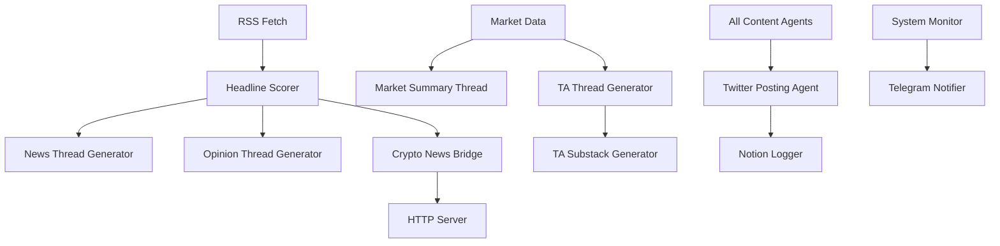

# AGENTS.md - System Architecture Documentation for AI Agents

## System Overview

The Hunter-Agent (formerly XAI Agent) is a comprehensive cryptocurrency content generation and social media automation system built around the "Hunter" persona - an AI-powered crypto analyst dog. The system operates as a containerized microservice within a larger ecosystem on DutchBrat.com, running on local VM infrastructure with Docker orchestration.

### Infrastructure Architecture

The Hunter-Agent runs as a containerized microservice within a broader ecosystem:

```
DutchBrat.com Ecosystem:
├── postgres (Database)
├── redis (Cache)
├── frontend (Next.js)
├── market-data-service (Port 8001)
├── htd-agent (HTD Research Agent - Port 3002)
├── hunter-agent (Crypto Content Agent - Port 3001)
└── nginx-articles (Static file server for articles)
```

**Container Network**: `production-network` (Docker Bridge)
**Orchestration**: Docker Compose
**Storage**: Local VM volumes with Docker bind mounts
**Article Serving**: Nginx static file server
- **Primary Role**: Crypto market analyst and content creator
- **Voice**: Witty, insightful, Web3-native, ends communications with "— Hunter 🐾"
- **Output Channels**: Twitter/X threads, Substack articles, website content
- **Content Types**: Market analysis, news commentary, technical analysis, educational explainers

## System Architecture

### Agent Classification

#### 1. Data Ingestion Agents
**RSS Feed Aggregator**
- **File**: `utils/rss_fetch.py`
- **Function**: Fetches crypto news from 15+ RSS sources hourly
- **Data Flow**: RSS → CSV (`scored_headlines.csv`) → GPT Scoring → Notion
- **Sources**: Coindesk, Decrypt, CryptoSlate, Cointelegraph, BeInCrypto, etc.
- **Rate Limiting**: 150 headlines max per ingestion cycle

**Headline Scoring Agent**
- **File**: `utils/scorer.py`
- **Function**: GPT-4 powered relevance and viral potential scoring (1-10 scale)
- **Input**: Raw headlines + extracted tickers
- **Output**: Scored headlines (threshold: 7+ for use)
- **Prompt Template**: "Score this news headline about {ticker} from 1 to 10, based on how likely it is to go viral on Twitter"

**Market Data Agent**
- **File**: `content/market_summary.py`
- **Function**: Fetches OHLCV data from Binance API
- **Tokens**: BTC, ETH, SOL, XRP, DOGE
- **Technical Indicators**: SMA (10, 50, 200), RSI, MACD
- **Chart Generation**: Matplotlib with TA overlays

#### 2. Content Generation Agents
**Thread Generator Agent**
- **File**: `utils/gpt.py`
- **Models**: Azure OpenAI GPT-4
- **Thread Types**: 
  - News recap (3 parts)
  - Market summary (5 parts)
  - Opinion threads (3 parts)
  - TA analysis (4 parts)
- **Delimiter**: "---" for multi-part content

**Substack Article Agent**
- **Files**: `content/ta_substack_generator.py`, `content/explainer_writer.py`
- **Base Class**: `utils/base_article_generator.py`
- **Output Format**: Markdown with embedded charts
- **Publishing Pipeline**: Local save → Local file storage → Notion logging → Tweet announcement
- **Article Storage**: `/app/posts` directory (Docker volume: `./hunter-agent-posts`)
- **Article Serving**: Nginx static server at `/articles` endpoint on DutchBrat.com

**Technical Analysis Agent**
- **File**: `content/ta_thread_generator.py`
- **Data Source**: Binance OHLCV (1000 days historical)
- **Indicators**: SMA10/50/200, RSI(14), MACD(12,26,9)
- **Chart Output**: Multi-panel candlestick + indicators
- **Memory System**: References previous week's analysis

#### 3. Social Media Agents
**Twitter/X Posting Agent**
- **File**: `utils/x_post.py`
- **API**: Twitter API v2 with v1.1 media upload
- **Rate Limits**: Built-in backoff and retry logic
- **Thread Safety**: Mutex locks for concurrent posting
- **Media Support**: PNG image uploads with tweets

**Reply Handler Agent**
- **File**: `content/reply_handler.py`
- **Function**: Monitors mentions, replies to direct responses
- **Rate Limit**: 1 reply per run, 5-minute cooldown
- **Context Matching**: Cross-references own tweet IDs from CSV log

**Random Content Agent**
- **File**: `content/random_post.py`
- **Probability Distribution**: 98% original, 1% quote tweet, 1% reply
- **XRP Special Logic**: Daily XRP headline usage with flag file
- **Content Enhancement**: Auto-insertion of cashtags and mentions

#### 4. Website Integration Agents
**News Bridge Agent**
- **File**: `crypto_news_bridge.py`
- **Function**: Processes headlines for DutchBrat.com integration
- **Output**: JSON API format with Hunter commentary
- **Rotation**: Top 4 headlines, 15-minute intervals
- **Source Mapping**: URL domain extraction to clean source names

**HTTP Server Agent**
- **File**: `http_server.py`
- **Process Manager**: `process_http_manager.py`
- **Endpoints**: `/crypto-news-data`, `/health`
- **Port**: 3001 (containerized)
- **Monitoring**: Health checks, auto-restart, resource tracking
- **Container**: Runs within Docker ecosystem alongside other microservices

#### 5. Monitoring and Maintenance Agents
**System Health Agent**
- **File**: `scheduler.py` (heartbeat function)
- **Frequency**: Every 15 minutes
- **Metrics**: CPU, memory, job stats, HTTP server status
- **Notification**: Telegram alerts with markdown formatting

**Log Rotation Agent**
- **File**: `utils/rotate_logs.py`
- **Schedule**: Weekly (Sundays)
- **Strategy**: Rolling retention for headlines (7 days), archive for logs
- **Cleanup**: XRP flag reset, memory optimization

**Job Registry Agent**
- **File**: `jobs/registry.py`
- **Function**: Centralized job management with categories and dependencies
- **Monitoring**: Execution stats, failure tracking, circuit breakers
- **Categories**: DATA_INGESTION, CONTENT_GENERATION, SOCIAL_POSTING, WEBSITE_GENERATION, MAINTENANCE, MONITORING

## Container and Infrastructure Context

### Docker Container Specifications
```dockerfile
FROM python:3.11-slim

WORKDIR /app

# System dependencies for compilation
RUN apt-get update && apt-get install -y gcc curl && rm -rf /var/lib/apt/lists/*

# Python dependencies with pandas_ta manual installation
COPY requirements.txt .
RUN sed -i '/pandas_ta/d' requirements.txt && pip install --no-cache-dir -r requirements.txt

# Manual pandas_ta installation from archive
COPY pandas_ta_complete.tar.gz /tmp/
RUN cd /tmp && tar -xzf pandas_ta_complete.tar.gz && \
    cp -r pandas_ta /usr/local/lib/python3.11/site-packages/ && \
    cp -r pandas_ta-0.3.14b0.dist-info /usr/local/lib/python3.11/site-packages/

# Application code and directory structure
COPY . .
RUN mkdir -p ta_posts posts logs data

EXPOSE 3001
CMD ["python", "scheduler.py"]
```

### Volume Mounts and Data Persistence
```yaml
volumes:
  - ./hunter-agent-posts:/app/posts:rw      # Article storage
  - ./Hunter-Agent/logs:/app/logs:rw        # Application logs  
  - ./Hunter-Agent/data:/app/data:rw        # Runtime data (CSV files)
```

### Network Configuration
- **Network**: `production-network` (Docker bridge)
- **Port Mapping**: `3001:3001` (host:container)
- **Service Dependencies**: None (autonomous operation)
- **Inter-service Communication**: HTTP-based via Docker network

### Article Serving Infrastructure
```yaml
nginx-articles:
  image: nginx:alpine
  container_name: nginx-articles
  volumes:
    - ./hunter-agent-posts:/usr/share/nginx/html/articles:ro
    - ./nginx-articles.conf:/etc/nginx/nginx.conf:ro
  networks:
    - production-network
```

**Article URL Structure**: `https://dutchbrat.com/api/articles/files/{category}/{filename}`
- **TA Articles**: `/api/articles/files/ta/filename.md`
- **Explainer Articles**: `/api/articles/files/explainer/filename.md`

### Primary Data Storage
```
data/scored_headlines.csv:
- score: float (1-10)
- headline: string
- url: string  
- ticker: string (extracted)
- timestamp: ISO datetime

data/tweet_log.csv:
- tweet_id: string
- timestamp: datetime
- type: string
- category: string
- text: string (optional)
- engagement_score: float

data/ta_log.csv:
- date: date
- token: string
- close: float
- sma10/50/200: float
- rsi: float
- macd/macd_signal: float
- gpt_summary: text
```

### Configuration Schema
```yaml
# Core AI Services
AZURE_OPENAI_API_KEY: string
AZURE_DEPLOYMENT_ID: string
AZURE_API_VERSION: string (default: "2024-02-15-preview")
AZURE_RESOURCE_NAME: string

# Twitter/X API
X_API_KEY: string
X_API_SECRET: string  
X_ACCESS_TOKEN: string
X_ACCESS_TOKEN_SECRET: string
X_BEARER_TOKEN: string
X_BOT_USER_ID: string

# Notion Integration
NOTION_API_KEY: string
HEADLINE_VAULT_DB_ID: string
NOTION_TWEET_LOG_DB: string
NOTION_SUBSTACK_ARCHIVE_DB_ID: string

# Telegram Notifications
TG_BOT_TOKEN: string
TG_CHAT_ID: string

# Container Configuration
HOST: string (default: "0.0.0.0")
PORT: int (default: 3001)
LOG_LEVEL: string (default: "INFO")

# Local Storage (replaces Azure Blob)
LOCAL_POSTS_DIR: string (default: "/app/posts")

# Email/SMTP
SMTP_HOST: string
SMTP_PORT: int (default: 587)
SMTP_USER: string
SMTP_PASS: string
ALERT_RECIPIENT: string
```

### Environment File Structure
The container receives configuration through multiple env files:
- `./config/secrets/api-keys.env`: API credentials
- `./config/services/hunter-agent.env`: Service-specific settings

## Data Models and Schemas

### Container File System Structure
```
/app/                           # Container working directory
├── content/                    # Content generation agents
├── utils/                      # Core utility agents and helpers
├── jobs/                       # Job registry and scheduling system
├── data/                       # Runtime data storage (mounted volume)
│   ├── scored_headlines.csv
│   ├── tweet_log.csv
│   ├── ta_log.csv
│   └── crypto_news_api.json
├── logs/                       # Application logs (mounted volume)
├── posts/                      # Generated articles (mounted volume)
│   ├── ta/                     # Technical analysis articles
│   └── explainer/              # Educational articles
├── charts/                     # Generated TA charts
├── backup/                     # Rotated log archives
└── ta_posts/                   # TA markdown archives
```

### Host System Integration
```
./hunter-agent-posts/           # Host directory for articles
├── ta/                         # Served at /api/articles/files/ta/
└── explainer/                  # Served at /api/articles/files/explainer/
```

## Agent Communication Patterns

### Inter-Agent Dependencies


### Data Flow Patterns
1. **News Pipeline**: RSS → Scoring → Storage → Content Generation → Publishing
2. **Market Pipeline**: API → Analysis → Charting → Content → Publishing  
3. **Monitoring Pipeline**: Metrics Collection → Health Assessment → Alerting
4. **Article Pipeline**: Content Generation → Local File Storage → Nginx Serving → DutchBrat.com Integration
5. **Container Communication**: Internal HTTP API → Docker network → Frontend integration

## Operational Procedures

## Operational Procedures

### Container Startup Sequence
1. **Container Initialization**: Docker pulls Python 3.11-slim base image
2. **Dependency Installation**: System packages (gcc, curl) and Python requirements
3. **pandas_ta Manual Installation**: From pre-packaged archive (pandas_ta_complete.tar.gz)
4. **Directory Structure Creation**: /app/posts, /app/logs, /app/data, /app/ta_posts
5. **Volume Mount Verification**: Host directories properly mapped to container paths
6. **Environment Validation**: API keys and configuration from env files
7. **Network Connectivity**: Docker bridge network `production-network` established
8. **Port Exposure**: Container port 3001 mapped to host port 3001
9. **Application Launch**: `python scheduler.py` as main process
10. **Health Check Initialization**: HTTP server readiness on /health endpoint
11. **Job Registry Setup**: All scheduled jobs registered and activated
12. **Telegram Startup Notification**: Container ready message sent

### Error Handling Strategies
- **Container Restart Policy**: `unless-stopped` ensures automatic recovery
- **API Failures**: Retry with progressive delays (5min, 10min, 15min)
- **Content Generation**: Fallback to cached/template responses
- **File System Issues**: Volume mount validation and error recovery
- **Network Isolation**: Docker network ensures service-to-service communication
- **Resource Limits**: Container resource monitoring and alerting

### Recovery Procedures
- **Container Health**: Docker daemon monitors container status
- **Volume Persistence**: Data survives container restarts via host mounts
- **Telegram Alerts**: All ERROR level events trigger notifications
- **Log Persistence**: Application logs stored on host file system
- **Article Persistence**: Generated articles survive system restarts
- **Configuration Recovery**: Environment files reload on container restart

## AI Behavioral Context

### Hunter Persona Guidelines
- **Tone**: Confident but not hype-driven, analytical, witty
- **Signature**: Always end with "— Hunter 🐾"
- **Emoji Usage**: Strategic, not excessive
- **Hashtags**: 1-2 relevant tags maximum
- **Cashtags**: Auto-insertion for major tokens ($BTC, $ETH, etc.)

### Content Generation Rules
- **Thread Length**: 3-5 parts maximum
- **Tweet Length**: <280 characters per part
- **Delimiter**: "---" for GPT thread separation
- **No Numbering**: Tweets should not be numbered (1/3, 2/3, etc.)
- **Link Placement**: URLs only in final tweet of threads

### Market Analysis Context
- **Timeframes**: Daily for news, weekly for TA, monthly for long-form
- **Data Sources**: Binance for price data, multiple RSS for news
- **Objectivity**: Avoid price predictions, focus on technical observations
- **Educational**: Explain concepts for crypto newcomers

## Security and Safety Mechanisms

### Rate Limiting
- **Daily Tweet Limit**: 17 tweets maximum (configurable via MAX_DAILY_TWEETS)
- **API Cooldowns**: 5-second delays between Twitter API calls
- **Retry Limits**: Maximum 3 attempts per failed operation

### Content Safety
- **Prompt Sanitization**: Clean escaped characters and markdown
- **Response Validation**: Check for appropriate signature and formatting
- **Source Verification**: URL validation before including in content
- **Duplicate Prevention**: CSV-based tracking of used content

### System Safety
- **Container Isolation**: Process isolation via Docker containerization
- **Resource Monitoring**: Memory and CPU usage tracking within container limits
- **Graceful Shutdown**: SIGTERM/SIGINT handlers for clean container termination
- **Volume-based Persistence**: Data survives container lifecycle via mounted volumes
- **Network Security**: Container-to-container communication via internal Docker network

## Integration Endpoints

### External APIs
- **Twitter API v2**: Tweet posting, thread creation, media upload
- **Twitter API v1.1**: Media upload (images)
- **Binance Public API**: OHLCV market data
- **OpenAI/Azure**: GPT-4 content generation
- **Notion API**: Database logging and content management
- **Telegram Bot API**: System notifications and alerts

### Internal Interfaces
- **Job Registry**: Centralized scheduling and dependency management  
- **File System**: CSV data persistence and log management via Docker volumes
- **Container Communication**: HTTP health endpoints and status reporting
- **Configuration Management**: Environment variable injection via Docker Compose
- **Article Serving**: Local file storage → Nginx static server → DutchBrat.com integration

## Deployment Considerations

### Container Requirements
- **Base Image**: Python 3.11-slim
- **Build Dependencies**: gcc, curl for compilation
- **Runtime Dependencies**: pandas_ta (manual installation), all requirements.txt packages
- **Working Directory**: /app
- **Exposed Port**: 3001
- **Process**: Single main process (`python scheduler.py`)

### Volume Requirements
- **Article Storage**: `./hunter-agent-posts:/app/posts:rw` (read-write for article generation)
- **Log Storage**: `./Hunter-Agent/logs:/app/logs:rw` (persistent logging)
- **Data Storage**: `./Hunter-Agent/data:/app/data:rw` (CSV files, runtime data)

### Network Requirements
- **Docker Network**: Must be on `production-network` bridge
- **Port Access**: 3001 for HTTP API endpoints
- **External APIs**: Outbound HTTPS for Twitter, OpenAI, Notion, Telegram, Binance
- **Internal Communication**: HTTP-based service discovery via Docker DNS

### Integration with DutchBrat.com Ecosystem
- **Article Integration**: Generated articles served via Nginx at `/api/articles/files/`
- **Frontend Integration**: Next.js frontend can access Hunter content via API
- **Database Independence**: Operates autonomously without direct database dependencies
- **Monitoring Integration**: Health status available for ecosystem monitoring

### Scaling Factors
- **Horizontal Scaling**: Container can be replicated with load balancer (shared storage considerations)
- **Resource Limits**: Configure Docker memory/CPU limits based on host capacity
- **Volume Scaling**: Host storage capacity determines article retention limits
- **API Rate Limits**: Built-in backoff prevents service degradation regardless of scaling
- **Container Orchestration**: Docker Compose provides basic orchestration, Kubernetes possible for advanced scaling

### Container Management Commands
```bash
# Start entire ecosystem
docker-compose up -d

# View Hunter-Agent logs
docker-compose logs -f hunter-agent

# Restart Hunter-Agent only
docker-compose restart hunter-agent

# Execute commands in container
docker-compose exec hunter-agent python scheduler.py status

# Monitor container resources
docker stats hunter-agent

# Access container shell
docker-compose exec hunter-agent /bin/bash
```

This documentation provides comprehensive system context for AI agents working on the containerized Hunter-Agent project. The system is designed for autonomous operation within a Docker ecosystem with persistent storage and integration with the broader DutchBrat.com platform.