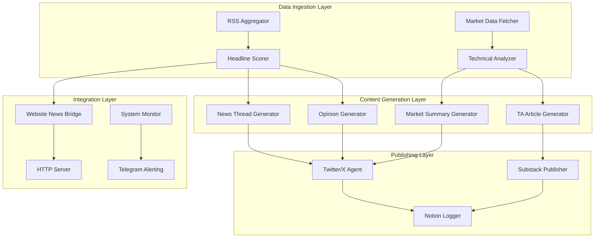

# XAI Agent - Hunter the Web3 Dobie 🐾

> An AI-powered cryptocurrency content generation and social media automation system integrated with [DutchBrat.com](https://www.dutchbrat.com)

## Overview

XAI Agent is a comprehensive autonomous system that embodies "Hunter," an AI cryptocurrency analyst with the persona of a witty Web3-native Doberman. The system automatically generates market analysis, news commentary, and educational content across multiple platforms while maintaining consistent brand voice and engagement strategies.

### Key Capabilities

- **🔄 Automated Content Pipeline**: RSS ingestion → AI scoring → Content generation → Multi-platform publishing
- **📊 Technical Analysis**: Real-time market data analysis with chart generation and trend identification  
- **🧵 Social Media Management**: Automated Twitter/X thread posting with engagement optimization
- **📝 Long-form Content**: Substack article generation with technical analysis and market explainers
- **🌐 Website Integration**: Dynamic news feed for DutchBrat.com with rotating headlines
- **🔍 Market Monitoring**: Multi-token price tracking with sentiment analysis and alert system
- **⚡ Health Monitoring**: Comprehensive system monitoring with Telegram notifications

## Architecture

### Agent-Based System Design

The system operates as a distributed agent architecture with specialized components:



### Core Components

#### Hunter AI Persona
- **Voice**: Analytical yet approachable, crypto-native commentary
- **Signature**: Always ends with "— Hunter 🐾"
- **Content Types**: Market analysis, news reactions, educational threads, technical analysis
- **Tone**: Confident but not hype-driven, witty insights with educational value

#### Content Generation Pipeline
1. **Data Ingestion**: 15+ RSS feeds monitored hourly
2. **AI Scoring**: GPT-4 powered relevance and viral potential scoring (1-10 scale)
3. **Content Creation**: Multi-format content generation (threads, articles, charts)
4. **Publishing**: Automated posting to Twitter/X, Substack, and website integration
5. **Monitoring**: Real-time tracking of engagement and system health

## Installation & Setup

### Prerequisites
- Python 3.8+
- Twitter/X API access (v2 + v1.1 for media)
- Azure OpenAI API access
- Notion workspace and API token
- Telegram bot for monitoring
- Azure Blob Storage (for article hosting)

### Quick Start

1. **Clone Repository**
   ```bash
   git clone https://github.com/your-org/XAIAgent.git
   cd XAIAgent
   ```

2. **Environment Setup**
   ```bash
   python -m venv .venv
   source .venv/bin/activate  # Linux/macOS
   # .\.venv\Scripts\activate  # Windows
   
   pip install -r requirements.txt
   ```

3. **Configuration**
   ```bash
   cp .env.example .env
   # Edit .env with your API credentials
   ```

4. **Initialize Data Directories**
   ```bash
   mkdir -p data logs charts backup ta_posts
   ```

5. **Run System**
   ```bash
   python scheduler.py
   ```

### Production Deployment

#### Using Supervisor (Recommended)
```bash
# Run setup script
chmod +x setup_supervisor.sh
./setup_supervisor.sh

# Manage service
sudo supervisorctl start hunter-scheduler
sudo supervisorctl status hunter-scheduler
```

#### Manual Service Management
```bash
# Check system status
python scheduler.py status

# Manage individual jobs
python scheduler.py disable market_summary
python scheduler.py enable market_summary

# Restart HTTP server
python scheduler.py restart-server
```

## Configuration

### Required Environment Variables

#### Core AI Services
```bash
# Azure OpenAI
AZURE_OPENAI_API_KEY="your-azure-openai-key"
AZURE_DEPLOYMENT_ID="your-gpt-4-deployment"
AZURE_RESOURCE_NAME="your-azure-resource"

# Twitter/X API
X_API_KEY="your-twitter-api-key"
X_API_SECRET="your-twitter-api-secret"
X_ACCESS_TOKEN="your-access-token"
X_ACCESS_TOKEN_SECRET="your-access-token-secret"
X_BEARER_TOKEN="your-bearer-token"
X_BOT_USER_ID="your-bot-user-id"
```

#### Data & Monitoring
```bash
# Notion Integration
NOTION_API_KEY="your-notion-key"
HEADLINE_VAULT_DB_ID="your-headline-db-id"
NOTION_TWEET_LOG_DB="your-tweet-log-db-id"

# Telegram Alerts
TG_BOT_TOKEN="your-telegram-bot-token"
TG_CHAT_ID="your-telegram-chat-id"

# Email Notifications
SMTP_HOST="smtp.gmail.com"
SMTP_USER="your-email@gmail.com"
SMTP_PASS="your-app-password"
```

### Optional Configuration
```bash
# System Limits
MAX_DAILY_TWEETS=17
LOG_LEVEL=INFO

# Azure Blob Storage (for Substack articles)
AZURE_BLOB_CONNECTION_STRING="your-blob-connection"
AZURE_BLOB_CONTAINER_NAME="substack-articles"
```

## Usage

### Daily Operations

The system operates autonomously on the following schedule:

#### Data Ingestion
- **:55 every hour**: Fetch and score cryptocurrency news headlines
- **:15 every hour**: Generate website news rotation data

#### Content Publishing  
- **13:00 daily**: Post news recap thread (3 parts)
- **14:00 daily**: Post market summary with price analysis (5 parts)
- **16:00 weekdays**: Post technical analysis for daily token (BTC Mon, ETH Tue, etc.)
- **23:45 daily**: Post top news opinion thread or skip if no major news

#### Long-form Content
- **18:00 Sundays**: Generate and publish weekly TA Substack article
- **23:45 Fridays**: Generate weekly explainer Substack article

#### Maintenance
- **23:50 Sundays**: Rotate logs and clean up old data
- **Every 15 minutes**: System health monitoring and alerts

### Manual Operations

#### Content Management
```bash
# Force headline ingestion
python -c "from utils import fetch_and_score_headlines; fetch_and_score_headlines()"

# Generate specific content type
python content/market_summary.py
python content/ta_thread_generator.py btc
python content/explainer_writer.py
```

#### System Management
```bash
# Check system health
python scheduler.py status

# View job execution history
python dobie_dashboard.py  # Streamlit dashboard

# Manual content posting
python -c "from utils import post_tweet; post_tweet('Test tweet — Hunter 🐾')"
```

#### Data Analysis
```bash
# Import Twitter analytics
python import_x_metrics.py

# View engagement dashboard
streamlit run dobie_dashboard.py
```

### Website Integration

The system provides a JSON API for DutchBrat.com integration:

#### Endpoints
- `GET /crypto-news-data`: Returns top 4 headlines with Hunter commentary
- `GET /health`: System health status

#### Response Format
```json
{
  "success": true,
  "data": [
    {
      "headline": "Bitcoin Reaches New All-Time High",
      "url": "https://example.com/article",
      "score": 8.5,
      "source": "coindesk",
      "hunterComment": "📈 This is huge for institutional adoption. Worth watching closely. — Hunter 🐾"
    }
  ],
  "lastUpdated": "2025-01-15T10:30:00Z",
  "rotationSchedule": "15min intervals"
}
```

## System Monitoring

### Health Monitoring
- **System Metrics**: CPU, memory, disk usage tracking
- **Job Execution**: Success/failure rates, execution times
- **API Status**: Rate limit tracking, error monitoring
- **Process Health**: HTTP server status, automatic restart policies

### Alert System
All critical events trigger Telegram notifications:
- ✅ Successful job completions
- ❌ Job failures with error details  
- ⚠️ Rate limit warnings
- 💚 System health heartbeats (every 15 minutes)
- 🔄 Automatic restart notifications

### Dashboard Access
```bash
# Web-based analytics dashboard
streamlit run dobie_dashboard.py

# Command line status
python scheduler.py status
```

## Content Strategy

### Hunter's Voice Guidelines
- **Analytical**: Focus on technical and fundamental analysis
- **Educational**: Explain complex concepts simply
- **Non-Hype**: Avoid price predictions and FOMO language
- **Community-Focused**: Engage with crypto Twitter conversations
- **Authentic**: Maintain consistent personality and signature

### Content Distribution
- **Twitter/X**: Primary platform for real-time engagement and analysis
- **Substack**: Long-form educational content and deep-dive analysis
- **Website Integration**: Curated news feed with Hunter's commentary
- **Notion**: Content archive and performance tracking

### Engagement Strategy
- **Cashtag Usage**: Automatic insertion of relevant token symbols ($BTC, $ETH)
- **Mention Strategy**: Tag relevant projects and thought leaders
- **Thread Optimization**: 3-5 part threads for maximum engagement
- **Timing**: Posts scheduled for optimal audience engagement

## API Integrations

### External Services
- **Twitter API v2/v1.1**: Social media posting and engagement
- **Binance API**: Real-time cryptocurrency market data
- **Azure OpenAI**: GPT-4 powered content generation
- **Notion API**: Content management and analytics tracking
- **Telegram Bot API**: System monitoring and alerts
- **Multiple RSS Feeds**: News aggregation from 15+ crypto sources

### Rate Limiting & Safety
- **Built-in Backoff**: Exponential retry strategies for API failures
- **Circuit Breakers**: Automatic job disabling after repeated failures
- **Daily Limits**: Configurable tweet limits to prevent spam
- **Content Validation**: Automated checks for appropriate content

## Development

### Project Structure
```
XAIAgent/
├── content/              # Content generation agents
│   ├── market_summary.py
│   ├── news_recap.py
│   ├── ta_thread_generator.py
│   └── explainer_writer.py
├── utils/                # Core utilities and helpers
│   ├── gpt.py           # AI content generation
│   ├── x_post.py        # Twitter/X integration
│   ├── notion_logger.py # Data persistence
│   └── headline_pipeline.py
├── jobs/                 # Job scheduling system
│   ├── registry.py      # Centralized job management
│   └── definitions.py   # Job definitions
├── data/                 # Runtime data storage
├── logs/                 # Application logs
└── scheduler.py          # Main orchestration system
```

### Code Quality
```bash
# Formatting
black .
isort .

# Linting  
flake8 .

# Type checking (optional)
mypy .
```

### Testing
```bash
# Run individual components
python -m content.market_summary
python -m utils.headline_pipeline

# Test API integrations
python project_usage.py  # Check Twitter API usage
```

## Troubleshooting

### Common Issues

#### Job Failures
```bash
# Check job status
python scheduler.py status

# View recent logs
tail -f logs/scheduler.log

# Restart specific job category
python scheduler.py disable market_summary
python scheduler.py enable market_summary
```

#### API Rate Limits
```bash
# Check Twitter API usage
python project_usage.py

# Monitor rate limit status
tail -f logs/x_post.log
```

#### HTTP Server Issues
```bash
# Restart HTTP server
python scheduler.py restart-server

# Check port availability
netstat -an | grep :3001

# View server logs
tail -f logs/http_server.log
```

### Log Analysis
- **Main System**: `logs/scheduler.log`
- **Content Generation**: `logs/gpt.log`
- **Twitter Integration**: `logs/x_post.log`
- **HTTP Server**: `logs/x_post_http.log`
- **Job Execution**: Individual job log files in `logs/`

## Security Considerations

### API Key Management
- All sensitive credentials stored in environment variables
- No API keys committed to repository
- Separate development and production environments recommended

### Rate Limiting
- Built-in Twitter API rate limit handling
- Configurable daily posting limits
- Automatic backoff strategies for API errors

### Content Safety
- Automated content validation and sanitization
- No reproduction of copyrighted material
- Responsible AI content generation practices

## Contributing

### Development Workflow
1. Fork the repository
2. Create feature branch (`git checkout -b feature/amazing-feature`)
3. Commit changes (`git commit -m 'Add amazing feature'`)
4. Push to branch (`git push origin feature/amazing-feature`)
5. Open Pull Request

### Code Standards
- Follow existing code style and structure
- Add comprehensive docstrings for new functions
- Update documentation for new features
- Test integrations before submitting PRs

## License

MIT License - see [LICENSE](LICENSE) file for details.

## Support

### Community
- GitHub Issues for bug reports and feature requests
- Documentation wiki for extended guides
- Code examples in `/examples` directory

### Monitoring
- Real-time system status via Telegram alerts
- Web dashboard for performance analytics
- Comprehensive logging for troubleshooting

---

**Built with barks, bytes, and blockchain analytics 🐾**

*For more information about the Hunter persona and content strategy, visit [DutchBrat.com](https://www.dutchbrat.com)*